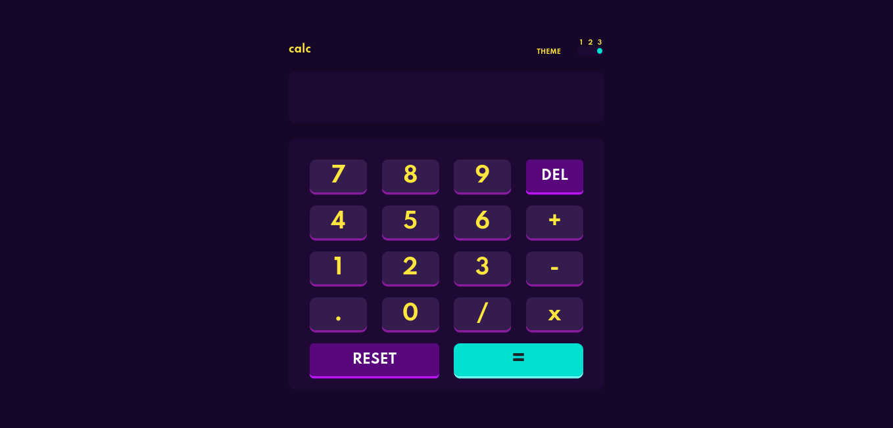

# Frontend Mentor - Calculator app solution

This is a solution to the [Calculator app challenge on Frontend Mentor](https://www.frontendmentor.io/challenges/calculator-app-9lteq5N29).

## Table of contents

- [Overview](#overview)
  - [The challenge](#the-challenge)
  - [Screenshot](#screenshot)
  - [Links](#links)
- [My process](#my-process)
  - [Built with](#built-with)
  - [What I learned](#what-i-learned)
  - [Useful resources](#useful-resources)
- [Author](#author)

## Overview

### The challenge

Users should be able to:

- See the size of the elements adjust based on their device's screen size
- Perform mathmatical operations like addition, subtraction, multiplication, and division
- Adjust the color theme based on their preference
- **Bonus**: Have their initial theme preference checked using `prefers-color-scheme` and have any additional changes saved in the browser

### Screenshot

### Links

- Solution URL: [Add solution URL here](https://your-solution-url.com)

## My process

### Built with

- Semantic HTML5 markup
- Vanilla javascript
- Sass, using flexbox and grid

**Note: These are just examples. Delete this note and replace the list above with your own choices**

### What I learned
I used this little project to learn the basics of sass (absolutely loved it), also learned a little
trick for styling of radio buttons that I applied to the theme selector.

### Useful resources

- [How to create a custom checkbox and radio buttons](https://www.w3schools.com/howto/howto_css_custom_checkbox.asp) - This helped me for styling the radio buttons.
- [Sass docs](https://sass-lang.com/documentation) - I'm learning Sass, so the docs were very useful.

## Author

- Frontend Mentor - [@AngryMorrocoy](https://www.frontendmentor.io/profile/AngryMorrocoy)
- Twitter - [@mrivxs](https://twitter.com/mrivxs)
